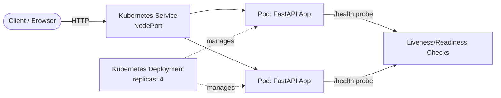

# Docker & Kubernetes Python API

[](https://github.com/Fadila-Yiddana/docker-k8s-python-api/actions/workflows/ci.yml)


A RESTful task management API built with **Python (FastAPI)**, containerized with **Docker**, and orchestrated with **Kubernetes** — built as a hands-on portfolio project to demonstrate cloud-native development practices from the ground up.

## Overview

This project started as a plain FastAPI CRUD app and was progressively hardened into something closer to production-grade: input validation, automated tests, a security-conscious Docker image, self-healing Kubernetes deployment, and an automated CI pipeline. Every step — including the mistakes and how they were debugged — is documented in the commit history.

## Architecture



Each Pod runs the same Docker image, built from a single non-root, layer-cache-optimized `Dockerfile`. The Deployment continuously ensures the desired number of healthy replicas is running; the Service load-balances traffic across them.

## Features

- Full CRUD REST API (Create, Read, Update, Delete tasks) built with FastAPI
- Request/response validation via Pydantic
- Automated test suite (pytest) covering all endpoints
- Dedicated /health endpoint used by Kubernetes liveness/readiness probes
- Docker image hardened with a non-root user and .dockerignore hygiene
- Kubernetes Deployment with self-healing (verified by manually killing a Pod and watching it auto-recover) and live horizontal scaling
- Docker Compose config for local multi-container development
- CI pipeline (GitHub Actions) that runs tests and verifies the Docker build on every push
- boto3-based AWS cost-safety script to flag long-running, cost-incurring cloud resources

## Tech Stack

| Category | Tools |
|---|---|
| Language | Python 3.12 |
| API Framework | FastAPI, Pydantic |
| Testing | pytest |
| Containers | Docker, Docker Compose |
| Orchestration | Kubernetes (Kind for local development) |
| CI/CD | GitHub Actions |
| Cloud | AWS (EKS deployment planned, see Roadmap) |
| Automation | boto3 (AWS SDK for Python) |

## Project Structure
```
docker-k8s-python-api/
├── main.py # FastAPI application
├── test_main.py # pytest test suite
├── requirements.txt
├── Dockerfile
├── docker-compose.yml
├── .dockerignore
├── .github/workflows/ci.yml # CI pipeline
├── k8s/
│ ├── deployment.yaml
│ └── service.yaml
└── scripts/
└── cost_guard.py # AWS cost-safety monitor
```

## Getting Started

### Run locally

```bash
python3 -m venv venv
source venv/bin/activate
pip install -r requirements.txt
uvicorn main:app --reload --host 0.0.0.0 --port 8000
```

Visit http://localhost:8000/docs for interactive Swagger UI.

### Run tests

```bash
pytest
```

### Run with Docker

```bash
docker build -t docker-k8s-python-api .
docker run -d -p 8000:8000 --name my-api docker-k8s-python-api
```

### Run with Docker Compose

```bash
docker compose up -d
```

### Deploy to Kubernetes (via Kind)

```bash
kind create cluster --name my-cluster
kind load docker-image docker-k8s-python-api-api:latest --name my-cluster
kubectl apply -f k8s/deployment.yaml
kubectl apply -f k8s/service.yaml
kubectl port-forward svc/docker-k8s-python-api-service 8080:8000
```

Visit http://localhost:8080/docs.

## What I Learned

- Layer caching matters: ordering `COPY requirements.txt` before `COPY . .` in the Dockerfile means dependency installation is skipped on rebuilds unless dependencies actually change — a real, measurable speed difference.
- Health checks aren't busywork: the /health endpoint built early in the project became the exact mechanism Kubernetes uses for liveness/readiness probes later — a direct example of designing for a system you haven't built yet.
- Kubernetes self-healing is real, not just documentation: deliberately deleting a running Pod and watching Kubernetes replace it automatically (backed by the Deployment's replicas count) made the concept concrete rather than theoretical.
- Imperative vs. declarative matters: after live-scaling the Deployment with kubectl scale, I updated deployment.yaml to match and re-applied it — keeping Git as the source of truth instead of letting the live cluster silently drift from what's committed.
- Security is a deliberate choice, not a default: containers run as root unless you explicitly create and switch to a non-root user — a small Dockerfile addition with real security implications.

## Roadmap

- [ ] Deploy to AWS EKS for a short, cost-monitored live cloud demonstration
- [ ] Add Prometheus/Grafana or CloudWatch-based monitoring dashboards
- [ ] Add a persistent database (currently in-memory storage)

## Author

**Fadila Yiddana** — [GitHub](https://github.com/Fadila-Yiddana) · [LinkedIn](https://www.linkedin.com/in/fadila-yiddana)
